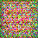
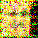
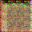

# Generative Adversarial Network

## Datasets
[LFW](http://vis-www.cs.umass.edu/lfw/). The input images are center cropped by 128 x 128, then resized to 64 x 64.

## GAN Setting in details
See [the model](gan/models)

## Discussion
- Adam with very low learning rate, e.g., 1. * 1e-5; otherwise easily fail to nan.
- Training G by maximizing log D(G(z)) instead could work well in my case.
- Generated images still remain blurring, we might need a more descriptive generator, e.g., increasing the number of parameters.
- Human face is very fine-grained, such that difficult to capture and to generate only uinsg random seed?

## Generated Image Examples

